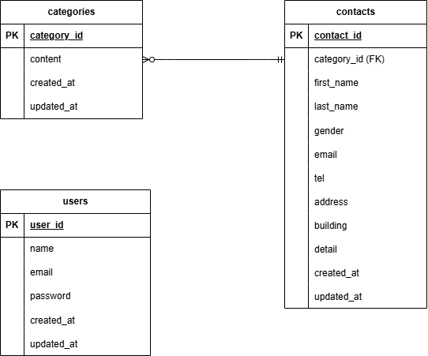

# お問い合わせフォームアプリ

## 環境構築
### dockerビルド
1. git clone リンク
2. docker-compose up -d --build

### Laravel環境構築
1. docker-compose exec php bash
2. composer install
3. .env.example ファイルから .env を作成し、環境変数を変更
4. php artisan key:generate
5. php artisan migrate
6. php artisan db:seed

## 使用技術
- Laravel 8.83.29
- PHP 8.1.33
- MySQL 8.x

## ER図

## URL
- 開発環境：http://localhost/
- phpMyAdmin：http://localhost:8080